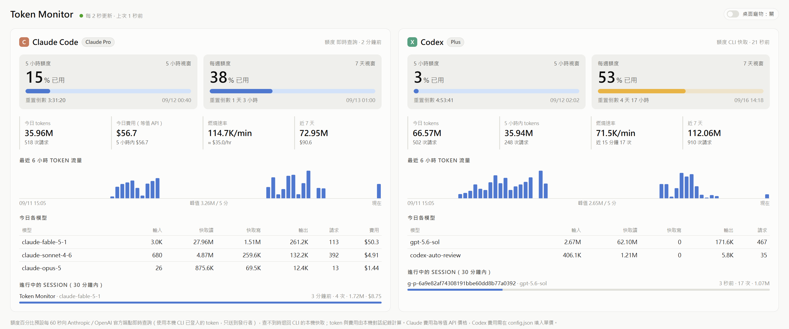
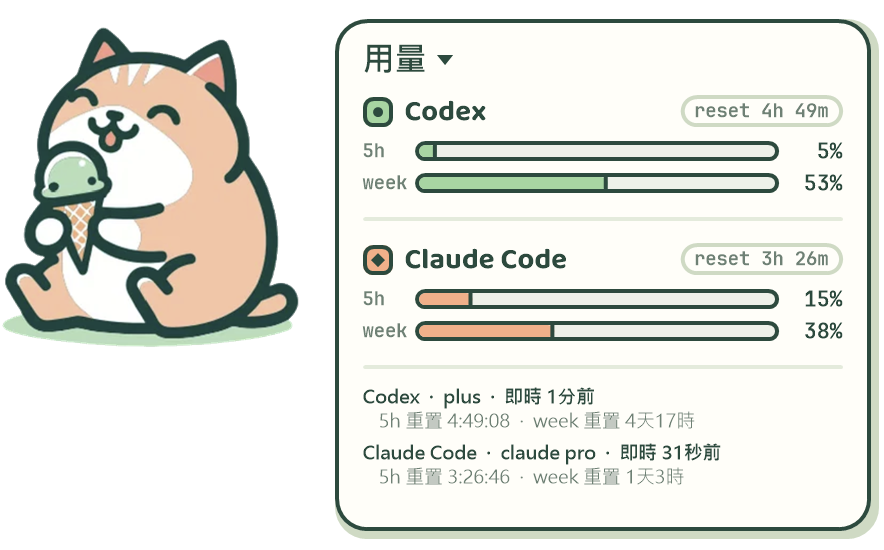
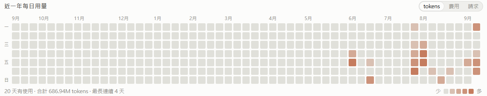
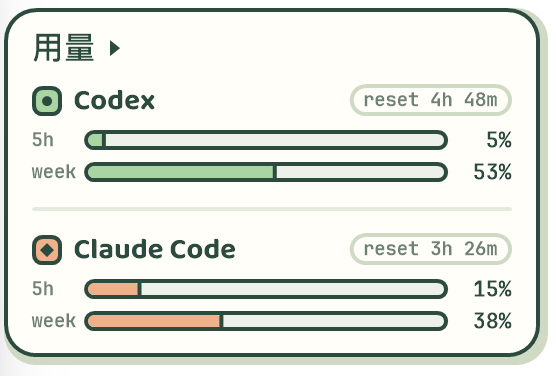

# Token Monitor

在 Windows 11 上即時查看 **Claude Code** 與 **Codex** 用量的本機儀表板，外加一隻會隨用量變臉的桌面寵物「用量小貓」。

- 純 Python 標準函式庫 + Windows 內建 API（GDI+、WinRT 通知），**不需要安裝任何套件**
- 所有資料都在本機計算；登入 token 只用來向 Anthropic / OpenAI 官方端點查額度，不送去其他地方
- 額度百分比即時查詢，token / 費用 / session 由本機對話紀錄算出、每 2 秒更新

<!-- 截圖：儀表板全景（http://127.0.0.1:8787/，要包含每日用量熱力圖） -->


<!-- 截圖：桌面寵物（完整模式，貓 + 用量卡） -->


---

## 目錄

- [功能](#功能)
- [快速開始](#快速開始)
- [儀表板](#儀表板)
- [桌面寵物](#桌面寵物)
- [資料從哪裡來](#資料從哪裡來)
- [設定](#設定)
- [Discord Bot](#discord-bot)
- [開機自動啟動](#開機自動啟動)
- [API](#api)
- [專案結構](#專案結構)
- [常見問題](#常見問題)

---

## 功能

| | Claude Code | Codex |
|---|---|---|
| 5 小時額度 % + 重置倒數 | ✅ | ✅ |
| 每週額度 % + 重置倒數 | ✅ | ✅ |
| 額外用量 credits（每月上限） | ✅（有開才顯示） | — |
| 方案名稱 | claude pro / max … | plus / pro … |
| 今日 / 5 小時 / 7 天 tokens 與請求數 | ✅ | ✅ |
| 費用 | 等值 API 價格（內建價目表） | 需自行在 `config.json` 填單價 |
| 燃燒速率（近 15 分鐘 tokens/min） | ✅ | ✅ |
| 最近 6 小時流量圖 | ✅ | ✅ |
| 近一年每日用量熱力圖（tokens / 費用 / 請求） | ✅ | ✅ |
| 今日各模型明細 | ✅ | ✅ |
| 進行中的 session 與 context 佔用 | ✅ | ✅ |
| 桌面寵物 + 跨門檻 Windows 通知 | ✅ | ✅ |

---

## 快速開始

需求：Windows 10/11、Python 3.11 以上（安裝時勾選「Add to PATH」）。

```
start.bat        # 背景啟動伺服器 + 桌面寵物，並開啟 http://127.0.0.1:8787/
pet.bat          # 只啟動桌面寵物（伺服器沒開的話它會自己拉起來）
stop.bat         # 全部停止
```

或手動：

```
python -m tokmon.server --open     # 伺服器 + 開瀏覽器
python -m tokmon.pet               # 桌面寵物
```

第一次啟動會掃描最近 8 天的對話紀錄（約 0.5 秒），之後只讀新增的部分；另外會在背景把全部歷史掃一遍（約 1 秒）建立每日用量表，給熱力圖用。

---

## 儀表板

`http://127.0.0.1:8787/`，每 2 秒自動更新，支援深色 / 淺色主題（跟隨系統）。

- **額度儀表**：5 小時 / 每週的已用 %、重置倒數與時間；顏色依嚴重度變化（50 / 75 / 90%）。Claude 若有開額外用量會多一條 credits
- **統計磚**：今日 tokens、今日費用、燃燒速率、近 7 天
- **流量圖**：最近 6 小時每 5 分鐘的 token 量，滑鼠移上去看數字
- **每日用量熱力圖**：GitHub 貢獻圖風格，一格一天、近一年，顏色越深用量越多（深淺以該來源自己的四分位數分級）。可切換 tokens / 費用 / 請求數，滑鼠移上去看當天明細，下方有使用天數、合計與最長連續天數
- **今日各模型**：輸入 / 快取讀 / 快取寫 / 輸出 / 請求數 / 費用
- **進行中的 session**：30 分鐘內有活動的 session，顯示專案、模型、context 佔用條
- **右上角「桌面寵物：開/關」**：啟動或關閉寵物
- 每張卡片右上角標示額度資料來源與更新時間（「即時查詢」或「CLI 快取」）

<!-- 截圖：近一年每日用量熱力圖（單張卡片的熱力圖區塊，滑鼠停在某一天上顯示提示） -->


---

## 桌面寵物

外觀依照 Claude Design 稿《Desktop Pet.dc.html》：吃冰淇淋的貓貼紙會慢慢上下浮動，旁邊是奶油色的用量卡，
Codex 綠色、Claude Code 蜜桃色各兩條（5h / week）與各自的 `reset` 倒數。置頂、無邊框、可拖曳、透明處可點穿。

### 操作

| 動作 | 效果 |
|---|---|
| 拖曳 | 移動（位置會記住） |
| 點「用量」旁的 ▸ | 展開 / 收合詳細資訊（方案、資料來源與更新時間、5h / week 重置倒數、credits） |
| 雙擊 | 開啟儀表板 |
| 右鍵 | 選單：顯示詳細資訊、顯示模式、靜音提醒、結束 |

顯示模式三選一：**完整**（貓 + 用量卡）、**只留貓**、**只留用量卡**。切換時視窗會平移，卡片留在原位。

<!-- 截圖：只留用量卡模式 -->


### 表情與提醒

貓的狀態跟著兩邊「最高的」額度百分比走：

| 狀態 | 範圍 | 貼紙檔 | 沒有貼紙時 |
|---|---|---|---|
| idle | 0–50% | `tokmon/assets/cat-idle.png` | — |
| working | 50–80% | `tokmon/assets/cat-working.png` | 用 idle 貼紙 |
| warning | 80–95% | `tokmon/assets/cat-warning.png` | idle 貼紙 + 汗滴 |
| limit | 95–100% | `tokmon/assets/cat-limit.png` | idle 貼紙 + zzz |

目前只有 idle 貼紙；其他三張畫好放進 `tokmon/assets/` 就會自動採用，任何尺寸皆可（透明背景 PNG）。

- 任一額度跨過 50 / 80 / 95% → 對話泡泡；跨過 80 / 95% 另外發 **Windows 通知**
- 額度重置 → 泡泡提醒
- 每 10–20 分鐘隨機講一句對應心情的話
- 兩個 CLI 都沒資料時打呼睡覺；有 token 在流動時會抖動

### 技術細節

- 繪圖用 **GDI+**（`tokmon/gdip.py`，ctypes 直接呼叫）：圓角、文字、貼紙縮放全部反鋸齒，`UpdateLayeredWindow` 逐像素透明；Tk 只負責視窗與滑鼠事件
- **DPI-aware**：在 150% / 200% 縮放的螢幕上以原生解析度繪製，不會被 Windows 拉伸變糊
- 字型 Baloo 2 / JetBrains Mono 隨附在 `tokmon/assets/fonts/`，以私有字型載入，不用安裝
- 寵物把 pid 寫在 `%LOCALAPPDATA%\TokenMonitor\pet.pid`，同時只會有一隻；位置與設定在同目錄的 `pet.json`

---

## 資料從哪裡來

程式讀的是**執行它那台電腦**的使用者家目錄，專案資料夾本身不含任何資料，複製到別台機器就會顯示那台的狀況。

| 資料 | 位置 | 用途 |
|---|---|---|
| Claude Code 對話紀錄 | `~/.claude/projects/**/*.jsonl` | 每次 API 回應的 token 用量 |
| Claude Code 額度快取 | `~/.claude.json` → `cachedUsageUtilization` | 額度 % 的備援值 |
| Claude 登入 token | `~/.claude/.credentials.json` | 查即時額度 |
| Codex 對話紀錄 | `~/.codex/sessions/**/*.jsonl` | token 用量 + Codex 每回合寫入的 `rate_limits` |
| Codex 登入 token | `~/.codex/auth.json` | 查即時額度 |

### 額度百分比

額度 % 是 Anthropic / OpenAI 伺服器算的**帳號總量**（含其他裝置、網頁版的使用），唯一來源是各家的 usage 端點——
跟 CLI 自己查的是同一個端點、同一組 token：

| | 端點 | 預設間隔 |
|---|---|---|
| Claude | `GET https://api.anthropic.com/api/oauth/usage` | 3 分鐘 |
| Codex | 本機 `codex app-server` 的 `account/rateLimits/read` | 1 分鐘 |

- token 只送到它的發行者，不寫回檔案、不送去別處
- 查詢失敗時沿用最後一次成功的值（或更新的 CLI 快取），儀表板會標示來源與更新時間；超過 30 分鐘一律標「可能過時」
- 失敗原因決定多久再試，不會一視同仁：
  - **限流**（Anthropic 429、chatgpt.com 前面的 Cloudflare 403 挑戰頁）：指數退避 10 → 20 → 40 分鐘，上限 1 小時，429 遵守 `Retry-After`
  - **斷網 / 逾時**（睡眠喚醒、Wi-Fi、VPN 切換）：1 → 2 → 4 分鐘，上限 10 分鐘
  - **token 過期**：每 5–10 分鐘試一次，等 CLI 自己刷新
- 偵測到電腦睡眠喚醒（時鐘一次跳超過 30 秒）就清掉累積的退避、立刻重查；限流中的只保留 1 分鐘緩衝
- 視窗的重置時間一過（例如 5 小時視窗歸零），不等固定間隔、直接提早再查；查到之前顯示「已重置 · 等待更新」而不是假裝 0%
- 最後一次成功的值存在 `%LOCALAPPDATA%\TokenMonitor\live-cache.json`，重啟不會倒退；重啟只繼承還沒到期的**限流**退避（連同原因），其他退避一律重來
- 每次查詢的結果與原因都寫進 `%LOCALAPPDATA%\TokenMonitor\server.log`（3 × 512 KB 輪替）
- Codex 每個回合結束都會自己把最新額度寫進本機紀錄，所以 Codex 活躍時本來就是即時的

為什麼不只看 CLI 快取：Claude Code 很少刷新它（實測 2.5 小時沒動，快取寫 35%、實際已 87%），Codex 只在回合結束時才寫。

### token 與費用

從本機對話紀錄計算，每 2 秒讀一次新增的部分，是真正即時的；但只包含**這台電腦**的使用。
Claude 費用是等值 API 價格（輸入 / 輸出 / 快取讀 0.1× / 快取寫 5 分鐘 1.25×、1 小時 2×），訂閱制用戶當作參考值即可。

記憶體只留 8 天的原始事件；熱力圖用的每日合計另外存在 `%LOCALAPPDATA%\TokenMonitor\daily-history.json`（保留 400 天）。第一次啟動、或伺服器停超過一週再開時，會在背景重新掃描全部對話紀錄把缺的日子補回來；8 天內的日子則由即時收集器每次整天覆寫，所以不會重複計算。

---

## 設定

複製 `config.example.json` 為 `config.json`（沒有也能跑，全部用預設值）：

```json
{
  "host": "127.0.0.1",
  "port": 8787,
  "poll_interval": 2.0,
  "live_usage": { "claude": true, "codex": true, "claude_interval": 180, "codex_interval": 300 },
  "codex_prices": { "gpt-5.6-sol": [1.25, 10.0, 0.1] },
  "claude_prices": {}
}
```

| 欄位 | 說明 |
|---|---|
| `poll_interval` | 讀本機對話紀錄的間隔（秒） |
| `live_usage.claude` / `.codex` | 是否向官方端點即時查額度；`false` 只用 CLI 快取 |
| `claude_interval` / `codex_interval` | 即時查詢間隔（秒，最少 60） |
| `codex_prices` / `claude_prices` | 每百萬 token 美元 `[輸入, 輸出, 快取讀取倍率]`；Codex 沒填就只顯示 tokens |

---

## Discord Bot

Discord 整合是選配功能，可在手機上用 Slash Command 查詢，並在額度跨過門檻或重置時收到通知。

### 1. 安裝選配套件

```powershell
python -m pip install -r requirements-discord.txt
```

### 2. 建立 Discord App

1. 到 [Discord Developer Portal](https://discord.com/developers/applications) 建立 Application。
2. 在 **Bot** 頁面建立 Bot 並複製 token。
3. 到 **OAuth2 → URL Generator**，勾選 `bot` 與 `applications.commands`。
4. Bot 權限勾選 `View Channels`、`Send Messages`，使用產生的網址把 Bot 加入自己的伺服器。
5. 在 Discord 開啟開發者模式，複製自己的 User ID 和接收通知的 Channel ID。

把 token 放在使用者環境變數，切勿寫進 `config.json`：

也可以直接雙擊 `setup-discord.bat`，在不顯示輸入內容的提示中貼上 Token；它會保存環境變數並重新啟動 Token Monitor。

```powershell
[Environment]::SetEnvironmentVariable("TOKMON_DISCORD_TOKEN", "你的 Bot Token", "User")
```

設定後要重新開啟命令列或重新登入 Windows，讓背景程式讀到新環境變數。

### 3. 啟用設定

把 `config.example.json` 複製成 `config.json`，並設定：

```json
"discord": {
  "enabled": true,
  "token_env": "TOKMON_DISCORD_TOKEN",
  "allowed_user_ids": ["你的 User ID"],
  "allow_all_users": false,
  "notification_channel_id": "通知 Channel ID",
  "dashboard_url": "手機可連線的 HTTPS 網址，未設定可留空",
  "ephemeral": true,
  "thresholds": [50, 80, 95],
  "check_interval": 30
}
```

重新啟動 Token Monitor 後可使用：

| 指令 | 說明 |
|---|---|
| `/usage source:all` | 查看額度、重置倒數與今日 Token |
| `/tokens source:codex` | 查看 Codex 今日／5 小時／7 天 Token |
| `/status` | 查看資料更新狀態與即時額度錯誤 |
| `/dashboard` | 顯示完整儀表板的連結按鈕（需先設定 `dashboard_url`） |

`allowed_user_ids` 必須填入獲准查詢者；空白時預設拒絕所有 Slash Command。只有確定要讓 Bot 所在伺服器的所有人查詢時，
才把 `allow_all_users` 改成 `true`。通知狀態存在
`%LOCALAPPDATA%\TokenMonitor\discord-state.json`，首次啟動只建立基準，不會把目前已跨過的門檻全部補發。

---

## 開機自動啟動

```powershell
powershell -ExecutionPolicy Bypass -File scripts\install-autostart.ps1
powershell -ExecutionPolicy Bypass -File scripts\uninstall-autostart.ps1   # 移除
```

建立名為 `TokenMonitor` 的工作排程器任務，登入後在背景啟動桌面寵物（寵物會順便拉起伺服器）。
用登入任務而不是 Windows 服務，是因為必須以你的使用者身分讀 `~/.claude` 與 `~/.codex`；SYSTEM 帳號看不到這些檔案。

---

## API

伺服器只綁 `127.0.0.1`，可以接到 Rainmeter、PowerToys 或自己的腳本：

若用 Tailscale Serve 給手機看，API 也會包含專案名稱、session 識別碼與用量；請保持 **tailnet only**，不要改用公開的
Tailscale Funnel。Token Monitor 本身不提供帳密登入，存取控制由本機回環介面與 Tailscale 負責。

| 方法 | 路徑 | 說明 |
|---|---|---|
| GET | `/api/snapshot` | 儀表板用的完整 JSON（額度、視窗統計、模型、session、流量序列、寵物狀態） |
| GET | `/api/history` | 每日用量表（近 400 天，兩個來源），熱力圖每 60 秒讀一次 |
| GET | `/api/health` | 存活檢查 |
| GET | `/api/pet` | 寵物是否在跑 |
| POST | `/api/pet/start` | 啟動寵物 |
| POST | `/api/pet/stop` | 關閉寵物 |

---

## 專案結構

```
start.bat / pet.bat / stop.bat      啟動與停止
config.example.json                 設定範例
scripts/
  install-autostart.ps1             登入自動啟動（工作排程器）
  uninstall-autostart.ps1
  stop.ps1
tokmon/
  server.py         HTTP 伺服器與 API
  collector.py      背景執行緒：讀紀錄、即時查詢、彙總視窗、快照
  history.py        每日用量表（熱力圖用，持久化在 %LOCALAPPDATA%）
  tailer.py         增量讀取 JSONL（只讀新增的位元組）
  claude_source.py  Claude Code 額度快取 + 對話紀錄解析
  codex_source.py   Codex rate_limits + token_usage_record 解析
  live.py           向官方端點即時查詢額度
  pricing.py        價目表與計價
  procs.py          程序輔助（pid 檔、啟動 / 停止寵物）
  pet.py            桌面寵物
  gdip.py           GDI+ 反鋸齒繪圖 + 逐像素透明視窗
  web/index.html    儀表板
  assets/           貓貼紙與字型
docs/screenshots/   README 用的截圖
```

---

## 常見問題

**額度 % 一直沒變？**
看卡片右上角的來源標示。「即時查詢」正常會每 3–5 分鐘更新，把滑鼠移到標示上會看到下次查詢時間；
標成橘色「可能過時」代表超過 30 分鐘沒查到新值，通常是端點限流退避中或 token 過期，原因同樣在滑鼠提示裡，
完整經過在 `%LOCALAPPDATA%\TokenMonitor\server.log`。token 統計不受影響。

**Codex 沒有費用？**
沒有內建 OpenAI 價目表，在 `config.json` 的 `codex_prices` 填入模型單價即可。

**複製到另一台電腦也能用嗎？**
可以，它會讀那台的 `~/.claude` 與 `~/.codex`。額度 % 是帳號層級的，兩台登入同一帳號就一樣；token 統計則是各台自己的。

**桌面寵物開兩隻了？**
不會——pid 檔保證同時只有一隻。若 pid 檔壞掉，刪除 `%LOCALAPPDATA%\TokenMonitor\pet.pid` 再啟動。

**PowerShell 腳本被擋？**
用 `-ExecutionPolicy Bypass` 執行，或在系統管理員 PowerShell 跑 `Set-ExecutionPolicy RemoteSigned -Scope CurrentUser`。

---

## 授權

[MIT](LICENSE)。隨附字型 Baloo 2 與 JetBrains Mono 為 SIL Open Font License 1.1。
